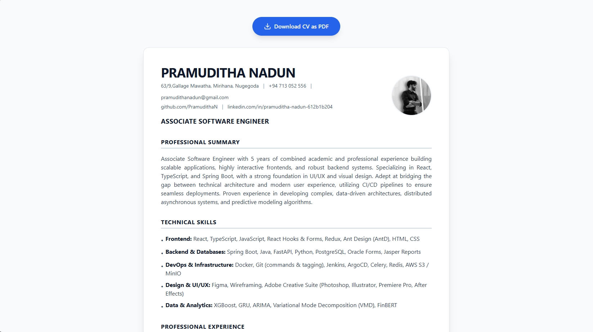

# pramuditha_cv


> A professional digital CV designed to showcase my journey as a Software Engineering student and Associate Software Engineer, featuring a responsive design and PDF download functionality.

---

## 📸 Preview

**CV Dashboard**


---

## 📖 About This Project

This project is a modern, interactive CV platform built with **React 19** and **TypeScript**. It serves as a comprehensive digital portfolio, highlighting my professional background, technical expertise, and academic achievements. The application is optimized for performance and accessibility, featuring a specialized export functionality that allows users to download a high-quality PDF version of the CV directly from their browser.

---

## ✨ Features

- 🚀 **Dynamic Profile** - Interactive presentation of professional experience and skills.
- 🎨 **Modern UI/UX** - Clean, professional aesthetic built with Tailwind CSS.
- 🌙 **Responsive Design** - Fully optimized for seamless viewing on mobile, tablet, and desktop.
- 📄 **PDF Export** - Instant, high-quality PDF generation using `jsPDF` and `html2canvas`.
- 🔍 **Interactive Contact** - One-click access to GitHub, LinkedIn, and Email.
- 💼 **Career Timeline** - Detailed tracking of professional roles and academic history.

---

## 🛠️ Tech Stack

| Layer | Technology |
|-------|-----------|
| Framework | [React v19.0.0](https://reactjs.org/) |
| Language | [TypeScript v4.9.5](https://www.typescriptlang.org/) |
| Styling | [Tailwind CSS v3.3.3](https://tailwindcss.com/) |
| Icons | [Lucide React v0.477.0](https://lucide.dev/) |
| PDF Generation | [jsPDF v3.0.0](https://github.com/parallax/jsPDF) |
| Deployment | [GitHub Pages](https://pages.github.com/) |

---

## 📋 Prerequisites

- [Node.js](https://nodejs.org/) **v16.18.0 or higher**
- [npm](https://www.npmjs.com/) or [pnpm](https://pnpm.io/)
- [Git](https://git-scm.com/)

---

## ⚙️ Getting Started

### 1. Clone the repository

```bash
git clone https://github.com/PramudithaN/pramuditha_cv.git
cd pramuditha_cv
```

### 2. Install dependencies

```bash
npm install
# or
pnpm install
```

### 3. Start the development server

```bash
npm start
```

Open [http://localhost:3000](http://localhost:3000) in your browser.

---

## 📦 Available Scripts

| Command | Description |
|---------|-------------|
| `npm start` | Runs the app in development mode. |
| `npm run build` | Builds the app for production to the `build` folder. |
| `npm test` | Launches the test runner. |
| `npm run deploy` | Deploys the application to GitHub Pages. |
| `npm run eject` | Removes the single build dependency from your project. |

---

## 📁 Project Structure

```
pramuditha_cv/
├── public/                  # Static assets and entry HTML
│   ├── cvImg.png            # CV Preview image
│   ├── index.html           # HTML template
│   └── manifest.json        # Web App Manifest
├── src/                     # Source code
│   ├── App.tsx              # Main CV logic and layout
│   ├── index.tsx            # Application entry point
│   ├── App.css              # Component-specific styles
│   └── index.css            # Global Tailwind directives
├── tailwind.config.js       # Styling configuration
├── tsconfig.json            # TypeScript configuration
└── package.json             # Project dependencies and scripts
```

---

## 🙋‍♂️ Connect with Me

- **GitHub**: [github.com/PramudithaN](https://github.com/PramudithaN)
- **LinkedIn**: [linkedin.com/in/pramuditha-nadun-612b1b204](https://linkedin.com/in/pramuditha-nadun-612b1b204)
- **Email**: pramudithanadun@gmail.com

---

*Developed with ❤️ by Pramuditha Nadun.*
